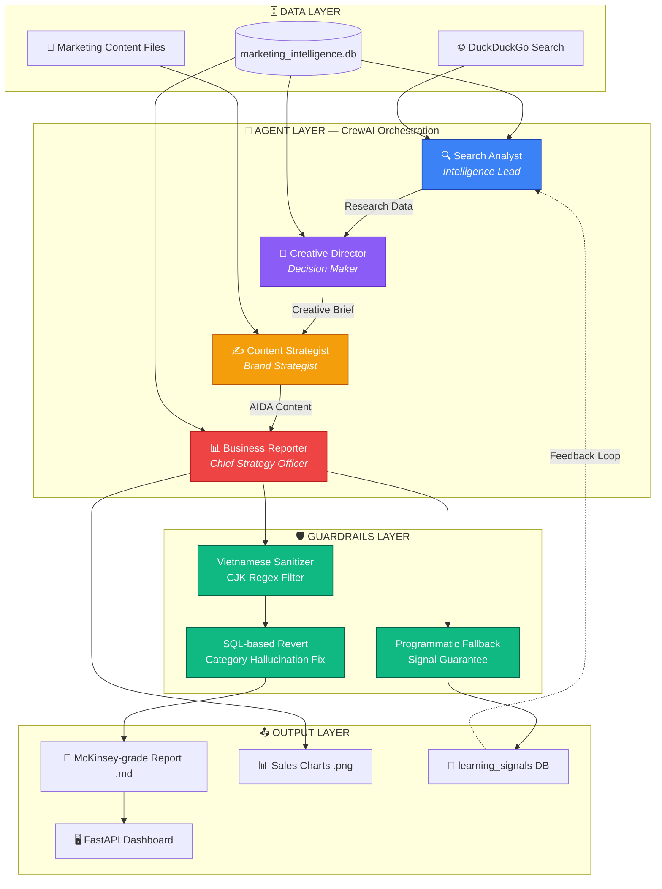
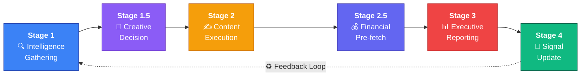

<p align="center">
  <h1 align="center">🧠 AI Marketing Intelligence & Reporting Automation</h1>
  <p align="center">
    <strong>Hệ điều hành Marketing thế hệ mới — Nơi Dữ liệu Điều khiển Sáng tạo, AI Triệt tiêu Ảo giác.</strong>
  </p>
  <p align="center">
    
    
    
    
    
  </p>
</p>

---

## 📖 Mục lục

- [Tổng quan & Giá trị cốt lõi](#-tổng-quan--giá-trị-cốt-lõi)
- [Kiến trúc Hệ thống](#-kiến-trúc-hệ-thống)
- [Đội ngũ Agent](#-đội-ngũ-agent--multi-agent-workforce)
- [Pipeline 6 giai đoạn](#-pipeline-6-giai-đoạn--creative-operating-loop)
- [Tính năng Kỹ thuật Đặc sắc](#-tính-năng-kỹ-thuật-đặc-sắc)
- [Công nghệ Sử dụng](#-công-nghệ-sử-dụng)
- [Cài đặt & Thiết lập](#-cài-đặt--thiết-lập)
- [Hướng dẫn Sử dụng](#-hướng-dẫn-sử-dụng)
- [Cấu trúc Dự án](#-cấu-trúc-dự-án)
- [Lộ trình Phát triển](#-lộ-trình-phát-triển)
- [Đóng góp & Bản quyền](#-đóng-góp--bản-quyền)

---

## 🎯 Tổng quan & Giá trị cốt lõi

### Vấn đề

Phần lớn các giải pháp AI Marketing hiện nay hoạt động như một **Content Engine đơn giản**: nhận prompt → xuất văn bản. Kết quả thường mắc phải ba lỗ hổng nghiêm trọng:

| # | Lỗ hổng | Hậu quả |
|---|---------|---------|
| 1 | **Hallucination** — AI tự bịa số liệu, tên sản phẩm | Báo cáo sai lệch, mất uy tín trước CEO/CMO |
| 2 | **Language Bleeding** — Trả về ký tự Trung/Nhật/Hàn trong nội dung Tiếng Việt | Output không thể sử dụng được trong môi trường doanh nghiệp |
| 3 | **Zero Memory** — Mỗi lần chạy là một trang giấy trắng, không tích lũy tri thức | Không có khả năng tự cải thiện qua các chu kỳ |

### Giải pháp

Hệ thống này được xây dựng theo triết lý **Marketing Strategy & Operations (MSO)** — một vòng lặp vận hành khép kín, nơi:

> **Dữ liệu SQL thực → Điều hướng Quyết định sáng tạo → Sản xuất Nội dung → Báo cáo cấp C-Level → Tích lũy bài học → Tối ưu chu kỳ tiếp theo.**

Đây không phải là một chatbot tạo nội dung. Đây là **hệ điều hành** cho toàn bộ lifecycle Marketing — từ nghiên cứu thị trường, ra quyết định chiến lược, đến báo cáo cấp quản trị và tự học.

---

## 🏗 Kiến trúc Hệ thống



---

## 🤖 Đội ngũ Agent — Multi-Agent Workforce

Hệ thống vận hành 4 Agent chuyên biệt, mỗi Agent được phân quyền công cụ riêng theo nguyên tắc **Principle of Least Privilege**:

| Agent | Vai trò | Công cụ được phép | Nhiệm vụ cốt lõi |
|:---:|:---|:---|:---|
| 🔍 **Search Analyst** | Intelligence Lead — Chuyên gia Phân tích Thị trường & Cạnh tranh | `search_internet`, `query_marketing_db` | Quét đa nguồn (Internet + SQL), xây dựng bản đồ cạnh tranh, xác định lợi thế và rủi ro dựa trên dữ liệu thực |
| 🎨 **Creative Director** | Decision Maker — Giám đốc Sáng tạo & Ra quyết định | `query_marketing_db` | Phân tích insight từ dữ liệu, xuất **Creative Brief** (Tone, Angles, Personas, Key Messages) — Không viết nội dung, chỉ chỉ huy |
| ✍️ **Content Strategist** | Brand Strategist — Định vị Thương hiệu | `read_marketing_content` | Thực thi Creative Brief thành 3 phương án nội dung AIDA đẳng cấp, tuân thủ 100% định hướng từ Creative Director |
| 📊 **Business Reporter** | Chief Strategy Officer (CSO) — Phong cách McKinsey/BCG | `query_marketing_db`, `save_report`, `create_sales_chart`, `signal_update` | Sản xuất báo cáo Executive Excellence 7 phần, vận hành BCG Matrix, quản trị rủi ro, ghi nhận Learning Signals |

> 💡 **Tại sao 4 Agent thay vì 1?** Mỗi Agent có chuyên môn riêng và chỉ truy cập vào đúng loại dữ liệu cần thiết. Search Analyst không thể lưu file. Content Strategist không thể truy vấn SQL tài chính. Điều này ngăn chặn "nhiễu" và tăng chất lượng output từng giai đoạn.

---

## 🔄 Pipeline 6 Giai đoạn — Creative Operating Loop



| Giai đoạn | Tên | Agent phụ trách | Mô tả |
|:-:|:---|:---|:---|
| **1** | Intelligence Gathering | 🔍 Search Analyst | Quét Internet + Truy vấn SQL → Benchmarking đối thủ, phân tích sentiment, xác định model dẫn đầu/yếu nhất |
| **1.5** | Creative Decision | 🎨 Creative Director | Chuyển hóa dữ liệu thô thành **Creative Brief** → Giọng điệu, Góc tiếp cận, Personas, Key Messages |
| **2** | Content Execution | ✍️ Content Strategist | Thực thi Creative Brief → 3 phương án nội dung AIDA (Pain Point, Flexing, Opportunity) |
| **2.5** | Financial Pre-fetch | 📊 Business Reporter | Truy xuất dữ liệu tài chính SQL thuần (ROI, CPA, Revenue theo khu vực) phục vụ báo cáo |
| **3** | Executive Reporting | 📊 Business Reporter | Soạn báo cáo 7 phần chuẩn McKinsey: Executive Summary → Tài chính → BCG Matrix → Cạnh tranh → Nội dung → Lộ trình 7 ngày → Quản trị Rủi ro |
| **4** | Signal Update | 📊 Business Reporter | Ghi nhận ≥3 Learning Signals (`low_performer`, `budget_realloc`, `trend_alert`) vào database |

---

## 💎 Tính năng Kỹ thuật Đặc sắc

### 🛡️ 1. Strict Data Grounding — Chống Hallucination bằng SQL

Thay vì yêu cầu LLM "tự nghĩ ra" số liệu, mọi Agent đều **bắt buộc** phải gọi `query_marketing_db` để lấy dữ liệu thực từ SQLite trước khi đưa ra nhận định. Lớp bảo vệ SQL gồm:

```
Lớp 1: Chỉ cho phép câu lệnh SELECT (whitelist)
Lớp 2: PRAGMA query_only = ON (database-level read-only)
Lớp 3: Quét từ khóa nguy hiểm (DROP, DELETE, UPDATE, INSERT, ALTER)
Lớp 4: Hướng dẫn tự sửa lỗi — Agent nhận được gợi ý khi dùng sai tên cột
```

> **Ví dụ**: Nếu Agent dùng `SELECT model FROM sales`, hệ thống sẽ trả về: *"Lỗi: Dùng `model_name` thay vì `model`."* — Thay vì crash, Agent tự sửa và thử lại.

### 🚫 2. Programmatic Guardrails — Rào chắn mã nguồn

Hai cơ chế bảo vệ hoạt động **sau khi** LLM đã sinh output, đảm bảo chất lượng 100% trước khi lưu file:

**a) Vietnamese Sanitizer** (`sanitize_vietnamese_text`)
- Sử dụng Regex quét toàn bộ output, phát hiện và loại bỏ **tuyệt đối** ký tự CJK (Trung Quốc: `\u4e00-\u9fff`, Nhật: `\u3040-\u30ff`, Hàn: `\uac00-\ud7af`).
- Ngăn chặn hiện tượng **Language Bleeding** — một lỗi phổ biến khi LLM đa ngôn ngữ vô tình trộn lẫn hệ ký tự.

**b) SQL-based Category Revert**
- Nếu output chứa danh mục chung chung như "Điện tử", "Smartphone", "Electronics", hệ thống sẽ:
  1. Tra cứu SQL để lấy `model_name` thực tế (VD: `Galaxy S26 Ultra`).
  2. Tự động thay thế danh mục chung bằng tên model cụ thể.
- Đảm bảo 100% Data Integrity trong mọi báo cáo.

### 🔄 3. Feedback Loop — Vòng lặp Tự cải thiện

Bảng `learning_signals` trong SQLite lưu trữ các bài học chiến lược sau mỗi chu kỳ:

```sql
CREATE TABLE learning_signals (
    id               INTEGER PRIMARY KEY AUTOINCREMENT,
    timestamp        TEXT NOT NULL,
    insight_type     TEXT NOT NULL,    -- 'low_performer' | 'budget_realloc' | 'trend_alert'
    learning_content TEXT NOT NULL     -- Mô tả chi tiết kèm số liệu
);
```

Cơ chế đảm bảo **double-safety**:
1. **LLM-driven**: Agent `Business Reporter` gọi tool `signal_update` ≥3 lần trong Stage 4.
2. **Programmatic Fallback**: Nếu LLM không gọi tool (hoặc gọi < 3 lần), hàm `_ensure_signal_updates()` trong `main.py` sẽ tự động trích xuất và ghi bổ sung signals.

### ⚡ 4. Error Resilience — Cơ chế tự phục hồi

Pipeline được trang bị **Exponential Backoff Retry**:

```python
# Tự nhận diện lỗi mạng/timeout và retry với delay tăng dần
retry_delay = 30s → 60s → 120s  (tối đa 3 lần)
# Nhận diện: Timeout, 504, 502, 503, 429, RateLimitError, ConnectionError
```

---

## 🔧 Công nghệ Sử dụng

| Phân loại | Công nghệ | Chi tiết |
|:---|:---|:---|
| **Ngôn ngữ** | Python 3.10+ | Type hints, pathlib, dataclasses |
| **Orchestration** | [CrewAI](https://www.crewai.com/) | Sequential Process, multi-agent coordination |
| **LLM** | Llama-3.3-70B | Primary: NVIDIA NIM, Fallback: OpenRouter (Free tier) |
| **Database** | SQLite | `marketing_intelligence.db` — 5 bảng, ~100+ records |
| **Backend** | FastAPI + Uvicorn | REST API, Background Tasks, Jinja2 Templates |
| **Frontend** | HTML5, CSS, JavaScript | Dashboard trực quan với KPI cards, biểu đồ, report viewer |
| **Search** | DuckDuckGo (ddgs) | Quét xu hướng Internet real-time |
| **Visualization** | Matplotlib + Pandas | Auto-generate biểu đồ doanh số `.png` |
| **Logging** | Python `logging` | File + Console, centralized config |

---

## 🚀 Cài đặt & Thiết lập

### Yêu cầu Hệ thống

- Python ≥ 3.10
- pip (trình quản lý gói Python)
- API Key từ **NVIDIA NIM** hoặc **OpenRouter** (một trong hai)

### Bước 1 — Clone Repository

```bash
git clone https://github.com/NgocTanHoang/AI-Marketing-Intelligence.git
cd "01_AI Agent System for Marketing and Reporting Automation"
```

### Bước 2 — Khởi tạo Virtual Environment

```bash
python -m venv venv

# Windows
venv\Scripts\activate

# macOS / Linux
source venv/bin/activate
```

### Bước 3 — Cài đặt Dependencies

```bash
pip install -r requirements.txt
```

### Bước 4 — Cấu hình Environment

Tạo file `.env` tại thư mục gốc dự án:

```env
# ===== LLM PROVIDER (Chọn ít nhất 1) =====

# Primary — NVIDIA NIM (Khuyến nghị: ổn định, nhanh)
NVIDIA_API_KEY=nvapi-xxxxxxxxxxxxxxxxxxxx

# Fallback — OpenRouter (Miễn phí, dự phòng khi NVIDIA hết quota)
OPENROUTER_API_KEY=sk-or-xxxxxxxxxxxxxxxxxxxx
```

> 💡 **Gợi ý**: Hệ thống tự động ưu tiên NVIDIA NIM. Nếu không có `NVIDIA_API_KEY`, sẽ chuyển sang OpenRouter. Nếu cả hai đều thiếu, pipeline sẽ dừng và thông báo lỗi rõ ràng.

### Bước 5 — Khởi tạo Database

```bash
python src/init_db.py
```

Lệnh này tạo `data/raw/marketing_intelligence.db` với 5 bảng dữ liệu synthetic:

| Bảng | Records | Mô tả |
|------|---------|-------|
| `sales` | ~100 | Dữ liệu bán hàng: model, giá, khu vực, nhóm tuổi, phương thức thanh toán |
| `competitor_products` | 8 | Benchmarking đối thủ: Apple, Samsung, Xiaomi, Oppo, Google, Vivo, Realme, Sony |
| `marketing_campaigns` | 14 | Chiến dịch marketing: budget, reach, conversions, ROI theo kênh |
| `social_sentiment` | 8 | Phản hồi thị trường: keyword trends, positive/negative scores, complaints |
| `sales_performance` | 10 | Hiệu suất bán hàng tổng hợp theo tháng |

---

## 📈 Hướng dẫn Sử dụng

### Chạy Pipeline AI (Core)

```bash
python main.py
```

Pipeline sẽ tuần tự thực thi 6 giai đoạn. Thời gian trung bình: **3–8 phút** (phụ thuộc vào tốc độ API).

Kết quả được lưu tại:
- 📄 **Báo cáo**: `data/processed/Smartphone_Strategic_Report_YYYYMMDD_HHMMSS.md`
- 📊 **Biểu đồ**: `data/processed/*.png`
- 📡 **Signals**: Tự động ghi vào bảng `learning_signals` trong SQLite
- 📝 **Logs**: `logs/system.log`

### Khởi chạy Dashboard (Web UI)

```bash
uvicorn app:app --reload --host 0.0.0.0 --port 8000
```

Truy cập: **http://localhost:8000**

Dashboard cung cấp:

| Module | Mô tả |
|--------|--------|
| 📊 KPI Summary | Tổng doanh thu, Units sold, ROI trung bình, Sentiment score |
| 🏆 Performance Ranking | Top 5 / Bottom 5 sản phẩm theo doanh thu & số lượng bán |
| 💳 Payment Dynamics | Phân bổ phương thức thanh toán, Cross-tab Tuổi × Thanh toán |
| 📈 Marketing Efficiency | ROI & CPA theo từng kênh marketing |
| 📄 Report Viewer | Đọc báo cáo chiến lược trực tiếp trên dashboard |
| 🚀 Pipeline Control | Kích hoạt pipeline từ UI, theo dõi trạng thái & logs real-time |
| 🔍 Smart Filters | Lọc dữ liệu theo Brand và Region |

---

## 📂 Cấu trúc Dự án

```
📦 AI-Marketing-Intelligence/
├── 📄 main.py                    # Entry point — Khởi chạy CrewAI Pipeline 6 giai đoạn
├── 📄 app.py                     # FastAPI Server — Dashboard Web UI & REST APIs
├── 📄 requirements.txt           # Dependencies (14 packages)
├── 📄 .env                       # API Keys (không track trong Git)
├── 📄 LICENSE                    # MIT License
│
├── 📁 src/                       # Core Application Logic
│   ├── agents.py                 # 🤖 Định nghĩa 4 Agents + LLM Factory (NVIDIA/OpenRouter)
│   ├── tasks.py                  # 📋 Cấu hình 6 Tasks với prompt engineering chuyên sâu
│   ├── tools.py                  # 🔧 Enterprise Tools: SQL, Search, Sanitizer, Charts, Signals
│   ├── config.py                 # ⚙️ Centralized Config: paths, logging, validation
│   └── init_db.py                # 🗄️ Database Initializer (5 bảng, dữ liệu synthetic)
│
├── 📁 data/
│   ├── 📁 raw/
│   │   ├── marketing_intelligence.db    # SQLite Database chính
│   │   └── 📁 marketing_content/        # 6 file .txt nội dung marketing nội bộ
│   ├── 📁 processed/                    # Output: Reports (.md) + Charts (.png)
│   └── pipeline.log                     # Log chạy pipeline từ Dashboard
│
├── 📁 templates/                 # Jinja2 Templates cho Dashboard
│   ├── index.html                # Giao diện chính (54KB — full-featured SPA)
│   ├── style.css                 # Stylesheet
│   └── script.js                 # Client-side logic
│
├── 📁 logs/                      # System logs
│   └── system.log
│
├── 📁 notebooks/                 # Jupyter Notebooks thử nghiệm
│   ├── experiments.ipynb
│   └── checklist.ipynb
│
├── 📁 image/README/              # Ảnh minh họa cho README
└── 📁 config/                    # Cấu hình bổ sung (reserved)
```

---

## 🗺️ Lộ trình Phát triển

| Ưu tiên | Tính năng | Trạng thái | Mô tả |
|:---:|:---|:---:|:---|
| 🔴 | **Dockerization** | 📋 Planned | Đóng gói Docker Container + `docker-compose.yml` cho one-click deployment |
| 🔴 | **Async Pipeline** | 📋 Planned | Chuyển sang `asyncio` + `aiohttp` cho xử lý song song, giảm thời gian pipeline |
| 🟡 | **Long-term Memory** | 📋 Planned | Tích hợp Vector Database (ChromaDB/Pinecone) để Agents ghi nhớ insight xuyên suốt nhiều tháng |
| 🟡 | **UI/UX Enhancement** | 📋 Planned | Nâng cấp Dashboard: Dark mode, interactive charts (Chart.js/D3.js), export PDF |
| 🟢 | **Multi-Market Support** | 💭 Exploring | Mở rộng hỗ trợ đa thị trường (Thailand, Indonesia) với schema linh hoạt |
| 🟢 | **A/B Testing Module** | 💭 Exploring | So sánh hiệu quả giữa các phương án nội dung AIDA bằng dữ liệu thực tế |

---

## 🤝 Đóng góp & Bản quyền

### Đóng góp

Mọi đóng góp đều được chào đón! Quy trình đề xuất:

1. **Fork** repository
2. Tạo **feature branch** (`git checkout -b feature/ten-tinh-nang`)
3. **Commit** thay đổi (`git commit -m 'feat: mô tả ngắn gọn'`)
4. **Push** lên branch (`git push origin feature/ten-tinh-nang`)
5. Tạo **Pull Request** với mô tả chi tiết

### Bản quyền

Dự án được phân phối theo **MIT License** — © 2026 [Hoàng Ngọc Tân](https://github.com/NgocTanHoang).

Xem chi tiết tại file [LICENSE](./LICENSE).

---

<p align="center">
  <sub>Được xây dựng với ❤️ bởi <b>Hoàng Ngọc Tân</b> — Kiến trúc sư AI & Marketing Automation.</sub>
</p>
