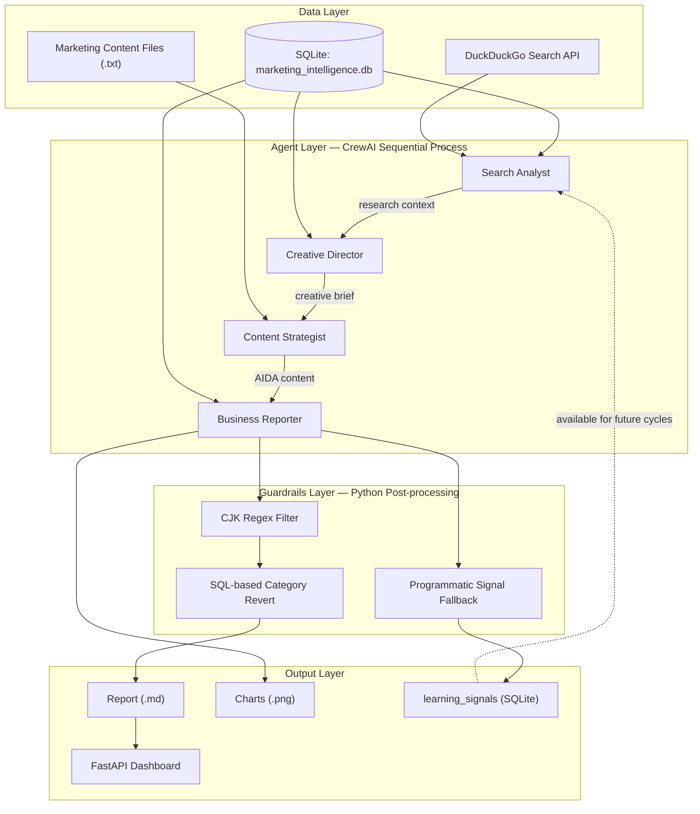

<<<<<<< HEAD
# AI Marketing Intelligence & Reporting Automation

**Hệ thống Multi-Agent hỗ trợ tự động hóa luồng phân tích dữ liệu và báo cáo Marketing chiến lược.**


=======
<p align="center">
  <h1 align="center">🧠 AI Marketing Intelligence & Reporting Automation</h1>
  <p align="center">
    <strong>Hệ điều hành Marketing thế hệ mới — Nơi Dữ liệu Điều khiển Sáng tạo, AI Triệt tiêu Ảo giác.</strong>
  </p>
  <p align="center">
    
    
    
    
    
  </p>
</p>
>>>>>>> 13e9d5e8962d591164e245edabc550a1092760d2

---

## Mục lục

- [Bối cảnh Kỹ thuật](#bối-cảnh-kỹ-thuật)
- [Giải pháp Kỹ thuật](#giải-pháp-kỹ-thuật)
- [Kiến trúc Hệ thống](#kiến-trúc-hệ-thống)
- [Agent & Task Workflow](#agent--task-workflow)
- [Chi tiết Triển khai](#chi-tiết-triển-khai)
- [Công nghệ](#công-nghệ)
- [Cài đặt & Chạy thử](#cài-đặt--chạy-thử)
- [Cấu trúc Thư mục](#cấu-trúc-thư-mục)
- [Giới hạn Hiện tại & Lộ trình](#giới-hạn-hiện-tại--lộ-trình)
- [Bản quyền](#bản-quyền)

---

## Bối cảnh Kỹ thuật

Khi sử dụng Large Language Models (LLMs) để tạo báo cáo marketing trong môi trường doanh nghiệp, có ba vấn đề kỹ thuật cần kiểm soát:

| Vấn đề | Mô tả | Biểu hiện cụ thể |
|:---|:---|:---|
| **Hallucination** | LLM tạo ra số liệu, tên sản phẩm, hoặc chỉ số tài chính không tồn tại trong nguồn dữ liệu gốc | Output chứa tên model sai, doanh thu bịa, hoặc gom sản phẩm vào danh mục chung (`"Điện tử"`, `"Smartphone"`) thay vì dùng tên model cụ thể |
| **Language Bleeding** | LLM đa ngôn ngữ vô tình trộn ký tự CJK (Trung, Nhật, Hàn) vào output Tiếng Việt | Các ký tự như `面臨`, `市場` xuất hiện xen giữa đoạn văn Tiếng Việt |
| **Context Drift** | Qua nhiều bước suy luận dài, LLM dần mất bám sát dữ liệu đầu vào và bắt đầu viết theo pattern chung | Báo cáo lặp lại các câu tổng quát, thiếu số liệu cụ thể từ database |

Hệ thống này là một bản MVP nhằm **giảm thiểu** các vấn đề trên thông qua kiến trúc Multi-Agent kết hợp các lớp guardrails ở cả tầng prompt lẫn tầng post-processing.

---

## Giải pháp Kỹ thuật

Ý tưởng chính: thay vì dùng một LLM duy nhất xử lý toàn bộ, hệ thống chia luồng công việc thành 6 task tuần tự, mỗi task do một Agent chuyên biệt phụ trách. Dữ liệu được **neo (anchor)** vào SQLite qua các lần gọi tool bắt buộc, và output cuối cùng đi qua một lớp sanitization bằng Python trước khi lưu file.

Ba cơ chế chính:

1. **Data Grounding** — Agent được yêu cầu (qua prompt) gọi tool `query_marketing_db` để truy vấn SQL thay vì tự sinh dữ liệu. Lớp tool chỉ cho phép `SELECT` và chạy ở chế độ read-only (`PRAGMA query_only = ON`).

2. **Post-processing Sanitization** — Sau khi LLM sinh output, hàm `sanitize_vietnamese_text()` trong Python quét và loại bỏ ký tự CJK bằng Regex, đồng thời tra cứu SQL để thay thế các danh mục chung chung bằng `model_name` thực tế.

3. **Programmatic Fallback** — Ở những điểm LLM có thể không thực thi đúng (ví dụ: không gọi tool `signal_update`), `main.py` chạy logic Python dự phòng để đảm bảo dữ liệu vẫn được ghi.

> **Lưu ý:** Các cơ chế trên giúp kiểm soát và giảm thiểu lỗi, nhưng không đảm bảo loại bỏ 100% hallucination ở mọi trường hợp. Chất lượng output phụ thuộc đáng kể vào khả năng của model LLM được sử dụng.

---

## Kiến trúc Hệ thống



**Luồng thực thi:** CrewAI điều phối 4 Agent chạy tuần tự (`Process.sequential`). Mỗi Agent nhận context từ task trước đó, gọi tool để lấy dữ liệu, và sinh output truyền cho Agent kế tiếp. Output cuối cùng đi qua lớp guardrails trước khi lưu file.

---

## Agent & Task Workflow

### Agents

Mỗi Agent được cấp một tập tool riêng, tuân theo nguyên tắc Least Privilege:

| Agent | Role | Tools | Input | Output |
|:---|:---|:---|:---|:---|
| **Search Analyst** | Phân tích thị trường & cạnh tranh | `search_internet`, `query_marketing_db` | Topic nghiên cứu (hardcoded trong `main.py`) | Bảng benchmarking đối thủ, top/bottom model, sentiment data, xu hướng thị trường |
| **Creative Director** | Ra quyết định định hướng sáng tạo | `query_marketing_db` | Context từ Search Analyst | Creative Brief: tone, angles, personas, key messages, kênh ưu tiên |
| **Content Strategist** | Thực thi nội dung | `read_marketing_content` | Creative Brief + nội dung marketing nội bộ (.txt) | 3 phương án nội dung theo cấu trúc AIDA |
| **Business Reporter** | Báo cáo chiến lược & feedback loop | `query_marketing_db`, `save_report`, `create_sales_chart`, `signal_update` | Toàn bộ context từ các Agent trước | Báo cáo 7 phần + biểu đồ + learning signals |

### Task Pipeline

| Stage | Task | Agent | Mô tả |
|:---:|:---|:---|:---|
| 1 | `research_task` | Search Analyst | Truy vấn SQL (competitor\_products, sales, social\_sentiment) + tìm kiếm Internet. Xuất bảng benchmarking, top/bottom products, sentiment |
| 1.5 | `creative_decision_task` | Creative Director | Phân tích research context → xuất Creative Brief gồm tone, angles, personas, messages. Có thể truy vấn SQL bổ sung để kiểm chứng |
| 2 | `content_creation_task` | Content Strategist | Thực thi Creative Brief → 3 phương án AIDA (Pain Point, Flexing, Opportunity) |
| 2.5 | `data_fetch_task` | Business Reporter | Pre-fetch 3 bảng dữ liệu tài chính thuần (ROI/CPA theo kênh, doanh thu theo model, doanh thu theo khu vực) |
| 3 | `marketing_strategy_task` | Business Reporter | Tổng hợp → báo cáo 7 phần: Executive Summary, Tài chính, BCG Matrix, Cạnh tranh, Nội dung, Lộ trình 7 ngày, Rủi ro |
| 4 | `signal_update_task` | Business Reporter | Ghi ≥3 learning signals (`low_performer`, `budget_realloc`, `trend_alert`) vào bảng `learning_signals` |

---

## Chi tiết Triển khai

### 1. Data Grounding — SQL-backed Tool Layer

Agent truy vấn dữ liệu thông qua `EnterpriseDataTools.query_marketing_db()`. Lớp này có các rào cản:

```
Lớp 1: Whitelist — Chỉ chấp nhận câu lệnh bắt đầu bằng SELECT
Lớp 2: Database-level — PRAGMA query_only = ON
Lớp 3: Blacklist — Quét từ khóa DROP, DELETE, UPDATE, INSERT, ALTER, TRUNCATE
Lớp 4: Error guidance — Trả về gợi ý khi Agent dùng sai tên cột
         (VD: "model" → gợi ý dùng "model_name", "price" → gợi ý dùng "unit_price")
```

Output mặc định là Markdown table, hỗ trợ thêm format JSON khi cần tạo biểu đồ.

### 2. Post-processing Sanitization

Hàm `sanitize_vietnamese_text()` trong `src/tools.py` chạy **sau khi** LLM đã hoàn thành output:

**a) CJK Filter:**
```python
# Regex quét và xóa ký tự Trung (U+4E00–9FFF), Nhật (U+3040–30FF), Hàn (U+AC00–D7AF)
cjk_pattern = re.compile(r'[\u4e00-\u9fff\u3040-\u30ff\uac00-\ud7af]')
text = cjk_pattern.sub('', text)
```

**b) Category Hallucination Revert:**
```python
# Nếu phát hiện danh mục chung ("Điện tử", "Electronics", ...):
# 1. Tra cứu SQL → lấy model_name có units_sold cao nhất
# 2. Thay thế danh mục chung bằng model_name thực tế
```

Cơ chế revert này hoạt động như một safety net. Nó xử lý được trường hợp phổ biến nhất (thay thế bằng top model), nhưng chưa xử lý được trường hợp LLM gán sai model vào sai vị trí trong bảng.

### 3. Programmatic Signal Fallback

Hàm `_ensure_signal_updates()` trong `main.py` kiểm tra sau khi pipeline hoàn tất:

```
1. Query bảng learning_signals: đếm signals được ghi trong 10 phút gần nhất
2. Nếu ≥ 3 signals → LLM đã thực hiện đúng → bỏ qua fallback
3. Nếu < 3 signals → Python tự ghi bổ sung 3 signals mặc định (extractive, từ report content)
```

Đây là pattern **"trust but verify"** — tin tưởng LLM sẽ thực thi tool, nhưng luôn có logic Python dự phòng.

### 4. Error Resilience

Pipeline wrapper trong `main.py` triển khai Exponential Backoff:

```python
retry_delay = 30  # giây
for attempt in range(1, MAX_RETRIES + 1):  # MAX_RETRIES = 3
    try:
        result = crew.kickoff()
        break
    except Exception as e:
        if is_retryable(e) and attempt < MAX_RETRIES:
            time.sleep(retry_delay)
            retry_delay *= 2  # 30s → 60s → 120s
```

Các lỗi được nhận diện để retry: `Timeout`, `504`, `502`, `503`, `429`, `RateLimitError`, `ConnectionError`, `ReadTimeout`.

### 5. LLM Provider Fallback

`MarketingAgents._build_llm()` ưu tiên provider theo thứ tự:

```
1. NVIDIA NIM  (nvidia_nim/meta/llama-3.3-70b-instruct)  — nếu có NVIDIA_API_KEY
2. OpenRouter   (openrouter/meta-llama/llama-3.3-70b-instruct:free) — nếu có OPENROUTER_API_KEY
3. Raise EnvironmentError — nếu cả hai đều thiếu
```

Tham số chung: `temperature=0.3`, `timeout=600s`, `max_tokens=4096`.

---

## Công nghệ

| Thành phần | Công nghệ | Ghi chú |
|:---|:---|:---|
| Ngôn ngữ | Python 3.10+ | |
| Orchestration | CrewAI | Sequential process, 4 agents, 6 tasks |
| LLM | Llama-3.3-70B | Qua NVIDIA NIM hoặc OpenRouter |
| Database | SQLite | 5 bảng, dữ liệu synthetic (~100 sales records) |
| API Server | FastAPI + Uvicorn | REST endpoints, background task execution |
| Frontend | HTML/CSS/JS + Jinja2 | Dashboard UI (server-rendered) |
| Web Search | DuckDuckGo (`ddgs`) | Tìm kiếm xu hướng thị trường |
| Visualization | Matplotlib + Pandas | Bar charts từ dữ liệu SQL |
| Logging | Python `logging` | File (`logs/system.log`) + Console |

---

## Cài đặt & Chạy thử

### Yêu cầu

- Python ≥ 3.10
- API Key từ [NVIDIA NIM](https://build.nvidia.com/) hoặc [OpenRouter](https://openrouter.ai/) (cần ít nhất một trong hai)

### Bước 1 — Clone & tạo Virtual Environment

```bash
git clone https://github.com/NgocTanHoang/AI-Marketing-Intelligence.git
cd "01_AI Agent System for Marketing and Reporting Automation"

python -m venv venv
# Windows
venv\Scripts\activate
# macOS / Linux
source venv/bin/activate
```

### Bước 2 — Cài đặt dependencies

```bash
pip install -r requirements.txt
```

### Bước 3 — Cấu hình environment

Tạo file `.env` tại thư mục gốc:

```env
# Ít nhất 1 trong 2 key sau phải được cung cấp.
# Hệ thống ưu tiên NVIDIA NIM, fallback sang OpenRouter.

NVIDIA_API_KEY=nvapi-xxxxxxxxxxxxxxxxxxxx
OPENROUTER_API_KEY=sk-or-xxxxxxxxxxxxxxxxxxxx
```

### Bước 4 — Khởi tạo database

```bash
python src/init_db.py
```

Tạo `data/raw/marketing_intelligence.db` với dữ liệu synthetic:

| Bảng | Records | Nội dung |
|:---|:---:|:---|
| `sales` | ~100 | Giao dịch bán hàng: brand, model, giá, khu vực, nhóm tuổi, phương thức thanh toán |
| `competitor_products` | 8 | Thông tin đối thủ: Apple, Samsung, Xiaomi, Oppo, Google, Vivo, Realme, Sony |
| `marketing_campaigns` | 14 | Chiến dịch: channel, budget, reach, conversions, ROI |
| `social_sentiment` | 8 | Phản hồi thị trường: keywords, scores, complaints, platforms |
| `sales_performance` | 10 | Hiệu suất tổng hợp theo tháng |

### Bước 5 — Chạy pipeline

```bash
python main.py
```

Thời gian thực thi: **3–8 phút** (phụ thuộc tốc độ API). Output:

| File | Vị trí |
|:---|:---|
| Báo cáo Markdown | `data/processed/Smartphone_Strategic_Report_YYYYMMDD_HHMMSS.md` |
| Biểu đồ (nếu có) | `data/processed/*.png` |
| System log | `logs/system.log` |
| Learning signals | Bảng `learning_signals` trong SQLite |

### Bước 6 (tuỳ chọn) — Khởi chạy Dashboard

```bash
uvicorn app:app --reload --host 0.0.0.0 --port 8000
```

Truy cập `http://localhost:8000`. Dashboard hỗ trợ:
- Xem KPI tổng hợp (doanh thu, units, ROI, sentiment)
- Ranking sản phẩm (top/bottom theo doanh thu & số lượng)
- Phân bổ phương thức thanh toán theo nhóm tuổi
- ROI & CPA theo kênh marketing
- Đọc báo cáo trực tiếp
- Kích hoạt pipeline từ UI + theo dõi logs
- Lọc theo Brand và Region

---

## Cấu trúc Thư mục

```
├── main.py                          # Entry point — Pipeline orchestration, retry logic, fallback
├── app.py                           # FastAPI server — Dashboard UI & REST API endpoints
├── requirements.txt                 # 14 Python dependencies
├── .env                             # API keys (git-ignored)
├── LICENSE                          # MIT
│
├── src/
│   ├── agents.py                    # 4 Agent definitions + LLM factory (NVIDIA/OpenRouter fallback)
│   ├── tasks.py                     # 6 Task definitions với structured prompts
│   ├── tools.py                     # Tool implementations: SQL query, search, sanitizer, chart, signal
│   ├── config.py                    # Centralized paths, logging, environment validation
│   └── init_db.py                   # Database seeder (5 tables, synthetic data)
│
├── data/
│   ├── raw/
│   │   ├── marketing_intelligence.db   # SQLite database chính
│   │   └── marketing_content/          # 6 file .txt — nội dung marketing nội bộ
│   ├── processed/                      # Output: reports (.md), charts (.png)
│   └── pipeline.log                    # Pipeline execution log (từ Dashboard)
│
├── templates/
│   ├── index.html                   # Dashboard UI (Jinja2 template)
│   ├── style.css
│   └── script.js
│
├── logs/
│   └── system.log                   # Centralized application log
│
├── notebooks/                       # Jupyter notebooks thử nghiệm
│   ├── experiments.ipynb
│   └── checklist.ipynb
│
└── image/README/                    # Ảnh minh họa cho README
```

---

## Giới hạn Hiện tại & Lộ trình

### Giới hạn

| # | Giới hạn | Chi tiết |
|:---:|:---|:---|
| 1 | **Dữ liệu synthetic** | Database hiện tại chứa dữ liệu demo được sinh ngẫu nhiên, không phản ánh thị trường thực tế |
| 2 | **Sequential processing** | Pipeline chạy tuần tự — thời gian thực thi phụ thuộc hoàn toàn vào tốc độ API của LLM provider |
| 3 | **Sanitizer coverage** | Category Revert chỉ thay thế bằng top-selling model — chưa xử lý được ánh xạ chính xác model vào đúng vị trí ngữ cảnh |
| 4 | **Feedback Loop chưa khép kín** | Bảng `learning_signals` được ghi nhưng chưa được đọc tự động ở chu kỳ tiếp theo (cần tích hợp vào prompt context) |
| 5 | **Single market** | Cấu trúc hiện tại hardcode cho thị trường Việt Nam (4 regions: North, South, Central, Highlands) |
| 6 | **Không có test suite** | Chưa có unit/integration tests |

### Lộ trình

| Ưu tiên | Mục tiêu | Trạng thái |
|:---:|:---|:---:|
| P0 | **Dockerization** — `Dockerfile` + `docker-compose.yml` cho reproducible deployment | Planned |
| P0 | **Async Pipeline** — Chuyển sang xử lý bất đồng bộ để giảm thời gian thực thi | Planned |
| P1 | **Closed-loop Feedback** — Đọc `learning_signals` vào prompt context ở đầu mỗi chu kỳ | Planned |
| P1 | **Long-term Memory** — Tích hợp Vector Database (ChromaDB) cho cross-cycle context | Planned |
| P2 | **Test Suite** — Unit tests cho tools, integration tests cho pipeline | Planned |
| P2 | **Dashboard Enhancement** — Interactive charts, dark mode, PDF export | Planned |

---

## Bản quyền

MIT License — © 2026 [Hoàng Ngọc Tân](https://github.com/NgocTanHoang)

Xem chi tiết tại [LICENSE](./LICENSE).
