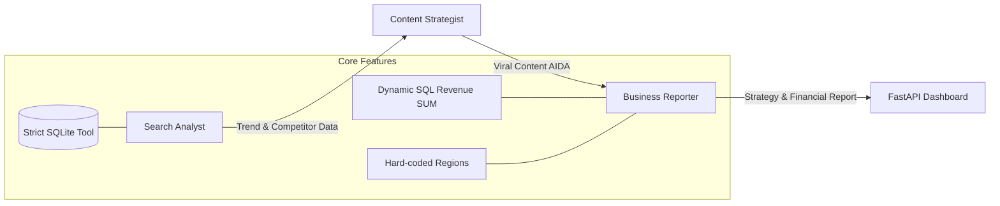

# 🚀 AI Agent System for Marketing & Reporting Automation

[](https://www.python.org/)
[](https://www.crewai.com/)
[](https://fastapi.tiangolo.com/)

**AI Marketing Intelligence Hub** là một hệ thống đa tác tử (Multi-Agent System) tinh vi, sinh ra để tự động hóa hoàn toàn quy trình báo cáo chiến lược Marketing. Hệ thống tự động thu thập thông tin từ Database doanh nghiệp, benchmark với đối thủ ngoài thị trường, chống bịa đặt dữ liệu (Zero Data Hallucination) và xuất ra các bản kế hoạch truyền thông, Content Social Media sắc bén.

---

## 📸 Hình ảnh tính năng chính (Screenshots)

### 1. 🖥️ Màn hình Dashboard Quản trị (FastAPI)
Giao diện High-Tech hiển thị các báo cáo chiến lược đã lưu, biểu đồ phân tích và thống kê ROI của từng Campaign.

)
*(Ghi chú: Thay thế file `assets/dashboard.png` bằng ảnh chụp màn hình tại `http://localhost:8000/`)*

### 2. 📄 Báo Cáo Chiến Lược (Markdown Strategy Report)
Kết quả trả ra từ các Agents được cấu trúc rõ ràng với các mục benchmark, phân tích lợi thế cạnh tranh, và ngân sách phân bổ theo đúng 4 vùng lãnh thổ (North, South, Central, Highlands).

)
*(Ghi chú: Ảnh chụp màn hình nội dung chi tiết của một Report Markdown điển hình)*

### 3. 🤖 Nhóm Agent Tương Tác Trên Terminal
Tiến trình CrewAI hoạt động mạnh mẽ, truy xuất SQLite và giao tiếp để tìm ra dòng máy Top 1 Doanh thu (Ví dụ: Find X9 Pro).


*(Ghi chú: Ảnh chụp màn hình Command Prompt / Terminal lúc đang chạy lệnh `python main.py`)*

---

## 🏗 System Architecture & Pipeline

Hệ thống hoạt động theo mô hình **Sequential Multi-Agent Pipeline** (Chạy tuần tự) được điều phối bởi CrewAI. Đặc biệt ở phiên bản mới nhất, các Agent được áp dụng kỷ luật dữ liệu cực gắt để không có tình trạng "AI tự chém số" (Hallucination).



### 🦸‍♂️ Các Persona Tác Tử (Agents)
1. **Search Analyst (Intelligence Lead)**: Nhận nhiệm vụ Query DB tìm ra sản phẩm "Top 1 Doanh Thu" hiện tại bằng SQL (`SUM(units_sold * unit_price)`), lấy thông tin đối thủ (Apple, Samsung...). 
2. **Content Strategist (Chief Slay Officer)**: Xây dựng 3 luồng nội dung Social (Facebook, TikTok, Instagram) theo format AIDA với tone giọng hiện đại, làm nổi bật giá trị cốt lõi so với các dòng máy cùng phân khúc.
3. **Business Reporter (Strategic Commander)**: Tổng hợp, chốt chặn không cho Agent bịa sai khu vực, tính toán ROI để đưa ra nhận định tiếp tục bơm tiền mặt hay cắt ngắn ngân sách cho từng cụm Campaign.

---

## 🛡️ Điểm Nhấn Công Nghệ (Core Updates)

-   **Zero Hallucination Mechanism**: Agent không được tự ý nói làm tròn doanh thu (không "48 tỷ" mà phải ghi đủ "48,000,000,000 VNĐ"). Agent cũng bị ép phải nhận định từ khóa chuẩn: vùng `North`, `South`, `Central`, `Highlands` - sai là đánh fail report.
-   **Terminal UTF-8 Ready**: Sẵn sàng chạy mượt mà trên môi trường Windows Terminal, in ra hệ thống icon Emoji trực quan (🚀, ❌, ⚡) không bị crash.
-   **FastAPI & Vanilla UI**: Dashboard cực kỳ mượt mà, render markdown báo cáo trực tiếp ra giao diện Web thông qua API.

---

## ⚙️ Hướng dẫn sử dụng nhanh (Quick Start)

### 1. Cài đặt môi trường
Đảm bảo bạn đang sử dụng Python 3.10+
```powershell
git clone <repository-url>
cd "01_AI Agent System for Marketing and Reporting Automation"
python -m venv venv
.\venv\Scripts\Activate.ps1
pip install -r requirements.txt
```

### 2. Thiết lập API Keys
Tạo file `.env` ở thư mục gốc:
```env
OPENROUTER_API_KEY=your_key_here
# HOẶC
NVIDIA_NIM_API_KEY=your_key_here
```

### 3. Khởi chạy Hệ thống & Web Dashboard
```powershell
# Chạy tiến trình Agent để sinh báo cáo mới
python main.py

# Bật Dashboard (Sẽ chạy ở cổng 8000)
uvicorn app:app --reload --port 8000
```
Truy cập: [http://localhost:8000](http://localhost:8000) để xem thành quả.

---

> [!IMPORTANT]
> **Khuyến nghị AI Model**: Dự án yêu cầu các model logic cao và hiểu ngữ cảnh tiếng Việt tốt như Llama 3.3 70B Instruct, Gemini 1.5/Gemini 3 hoặc GPT-4o để phát huy đối đa sức mạnh phân tích.

**Tác giả**: [Ngọc Tân Hoàng](https://github.com/NgocTanHoang)  
**Tình trạng dự án**: Đã ổn định (Stable) - *Hoàn thiện chống Hallucinate Data*
