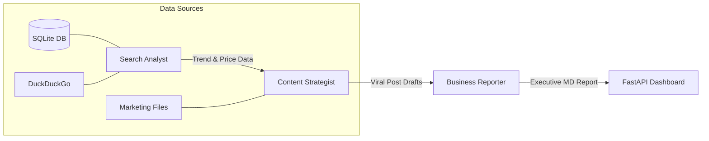

# 🛡️ COGNITIVE SHADOW v2.5
## AI Marketing Intelligence & Reporting Automation System

[](https://www.python.org/)
[](https://www.crewai.com/)
[](https://openrouter.ai/)
[](https://fastapi.tiangolo.com/)

**Cognitive Shadow** is a sophisticated multi-agent AI system designed to replace manual marketing reporting with a **Data-Triangulated Intelligence Pipeline**. It scours the internet, queries enterprise databases, and analyzes internal content to generate "viral-ready" social media strategies and executive retail reports.

---

## ⚡ Key Upgrades (v2.5 - "The Slay Update")

In version 2.5, the system moved beyond simple data reporting to **Active Market Critique**:

| Feature | Description |
| :--- | :--- |
| **🚀 Gen Z Viral Engine** | The `Content Strategist` now uses a strict **AIDA structure** (Attention, Interest, Desire, Action) and Gen Z slang (Slay, Flex, Chill, Tới công chuyện) for high-engagement social posts. |
| **📐 Data Triangulation** | Agents perform 3-way cross-referencing: **SQL Records** (Sales/ROI) + **Live Web** (Competitor Pricing) + **Internal TXT Docs** (KOL Reviews). |
| **⚖️ Price War Analysis** | Automated comparison between **Apple vs Samsung** pricing segments to explain market shifts and "Win/Loss" factors. |
| **🛡️ Anti-Hallucination** | Hard-coded SQL guardrails to prevent inflated reach/engagement figures (no more "billions of users" errors). |

---

## 🏗 System Architecture

The project follows a **Sequential Multi-Agent Pipeline** orchestrated by CrewAI:



### Specialized Agent Personas:
1.  **Search Analyst (The Scout)**: Monitors competitor pricing and "Viral Trends" across the smartphone retail landscape.
2.  **Content Strategist (The Growth Hacker)**: Transforms raw data into "cháy" (fire) social media scripts with viral hooks and trending hashtags.
3.  **Business Reporter (The Strategist)**: The final decision-maker. Synthesizes all data, performs ROI calculations, and explains "WHY WE WIN/LOSE".

---

## 🛠 Tech Stack

-   **Orchestration**: [CrewAI](https://crewai.com)
-   **Intelligence**: [OpenRouter](https://openrouter.ai) / [NVIDIA NIM](https://www.nvidia.com/en-us/ai/nim/) (Llama 3.3 70B)
-   **Backend**: FastAPI
-   **Frontend**: Vanilla HTML/CSS (Google Stitch Style) + Chart.js
-   **Data**: SQLite + Matplotlib

---

## 📊 Enterprise Data Schema

The system operates on 5 "Golden Tables" of retail intelligence:
-   `sales`: Granular transaction data (Pay method, Region, Age).
-   `competitor_products`: Real-time tracking of Apple, Samsung, Xiaomi, etc.
-   `social_sentiment`: Keyword-based emotion tracking (Positive/Negative/Mentions).
-   `marketing_campaigns`: ROI/CPA tracking per channel.
-   `sales_performance`: Monthly revenue summaries.

---

## ⚙️ Quick Start

### 1. Installation
```powershell
git clone <repository-url>
cd "01_AI Agent System for Marketing and Reporting Automation"
python -m venv venv
.\venv\Scripts\Activate.ps1
pip install -r requirements.txt
```

### 2. Environment Setup
Create a `.env` file with your API keys:
```env
OPENROUTER_API_KEY=your_key_here
# OR
NVIDIA_NIM_API_KEY=your_key_here
```

### 3. Initialize & Execute
```powershell
# Setup Database
python src/init_db.py

# Launch Web Dashboard
uvicorn app:app --reload --port 8000
```
Visit: `http://localhost:8000`

---

## 📂 Project Structure

-   `app.py`: FastAPI Web Server & API Endpoints.
-   `src/agents.py`: CrewAI Agent definitions & LLM configuration.
-   `src/tasks.py`: Sequential task logic & Prompt engineering.
-   `src/tools.py`: Custom-built tools (SQL, Search, Charting).
-   `data/`: Raw SQLite DB and processed Markdown reports.
-   `templates/`: Stitch-inspired High-Tech UI components.

---

> [!IMPORTANT]
> **Cognitive Shadow** requires an LLM with strong Vietnamese language capabilities and logical reasoning (recommend: Llama 3.3 70B or GPT-4o).

**Author**: [Ngọc Tân Hoàng](https://github.com/NgocTanHoang)  
**Version**: 2.5.0 - *Refined Content & Data Logic*
